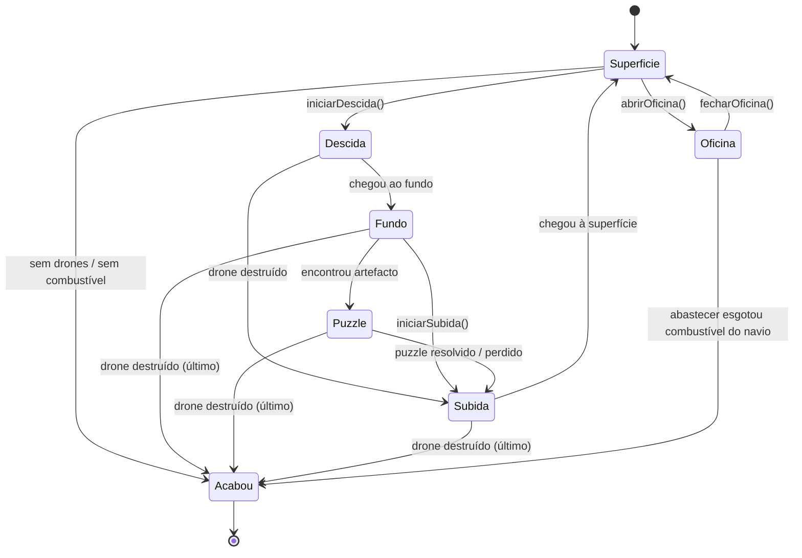

# Deep Sea Mining 🌊🚁

<div align="center">

**Instituto Superior de Engenharia de Coimbra (ISEC)**  
Licenciatura em Engenharia Informática  
Unidade Curricular: **Programação Avançada** — 2025/2026  
Docente: **Prof. Álvaro Santos**

</div>

---

## 🏆 Avaliação

> **Nota Final: 94 / 100**

---

## 👥 Grupo

| Nome | Nº Aluno |
|------|----------|
| Diogo Pinto| a2024152576 |
| Rafael Marques | a2024143044 |
| Vera Ribeiro| a2024140140 |

---

## 📖 Sobre o Projeto

O **Deep Sea Mining** é um jogo de estratégia e exploração desenvolvido inteiramente em **Java** com interface gráfica em **JavaFX**. O jogador assume o comando de uma operação de resgate em águas profundas com o objetivo de recuperar artefactos perdidos de uma civilização antiga.

A missão exige uma gestão rigorosa de recursos — combustível e integridade do casco dos drones — e a superação de perigos nas profundezas do oceano. O jogo desenrola-se alternando entre a **gestão estratégica do navio à superfície** e a **exploração subaquática** através de drones.

### 🎮 Mecânicas Principais

- **Gestão de Drones:** O jogador dispõe de 3 drones, usando apenas um de cada vez nas expedições. Cada drone tem combustível e integridade próprios, podendo ser reparado e abastecido na oficina do navio.
- **Zonas de Jogo:**
  - **Superfície** — Grelha de gestão e preparação onde o navio se desloca para posicionar a descida do drone.
  - **Fosso Marinho** — Fase de descida e subida com obstáculos (rochas, animais marinhos, correntes) que danificam ou desviam o drone.
  - **Fundo do Mar** — Zona de exploração para recolha de minérios e artefactos, com monstros marinhos a patrulhar.
  - **Puzzle** — Desafio lógico (tipo *sliding puzzle*) que o jogador deve resolver para recuperar um artefacto.
  - **Oficina** — Ecrã de manutenção onde se abastecem e reparam os drones usando o combustível do navio.
- **Coleção:** O objetivo global é completar uma coleção de *n* artefactos únicos para vencer o jogo.
- **Condições de Derrota:** O jogo termina se todos os drones forem destruídos ou se o navio ficar sem combustível suficiente para operar.

---

## 🏗️ Arquitetura e Padrões de Design

O projeto foi desenvolvido seguindo o paradigma da **Programação Orientada a Objetos (POO)**, aplicando a arquitetura **Model-View-Controller (MVC)** e diversos padrões de design:

| Padrão | Aplicação no Projeto |
|--------|---------------------|
| **Finite State Machine (FSM)** | Gestão do fluxo do jogo através de estados (`SuperficieState`, `DescidaState`, `FundoState`, `SubidaState`, `PuzzleState`, `OficinaState`, `AcabouState`) com transições controladas por um `DeepSeaContext`. |
| **Factory Method** | Enum `DeepSeaState` com método `getInstance()` que instancia o estado concreto correto. |
| **Observer** | `PropertyChangeSupport` no `DeepSeaManager` notifica as views (RootPane, Canvas, Barras Laterais) de alterações no modelo. |
| **Singleton** | Classe `DeepSeaLog` — log centralizado do jogo com instância única. |
| **Facade** | `DeepSeaManager` expõe uma API simplificada à UI, escondendo a complexidade do `DeepSeaContext` e do `Jogo`. |
| **Multiton** | Gestão de recursos multimédia (imagens) com `ImageLoader`. |
| **State (via Adapter)** | `DeepSeaStateAdapter` — classe abstrata que implementa `IDeepSeaState` com comportamento por omissão, evitando código repetido nos estados concretos. |

---

## 📂 Estrutura do Projeto

```text
📦 DeepSeaMining/
 ┣ 📂 reports/                                # Relatórios e diagramas
 ┃ ┣ 📄 Relatorio.pdf                         # Relatório final
 ┃ ┣ 📄 DiagramaEstados.pdf                   # Diagrama de estados da FSM
 ┃ ┣ 📄 diagrama_classes.png                  # Diagrama geral de classes
 ┃ ┗ 📄 *.jpeg                                # Diagramas dos padrões de design
 ┣ 📂 src/
 ┃ ┣ 📂 main/
 ┃ ┃ ┣ 📂 java/pt/isec/pa/deepsea/
 ┃ ┃ ┃ ┣ 📄 DeepSeaApp.java                   # Ponto de entrada da aplicação
 ┃ ┃ ┃ ┣ 📂 model/
 ┃ ┃ ┃ ┃ ┣ 📄 DeepSeaManager.java              # Facade + Observer (PropertyChangeSupport)
 ┃ ┃ ┃ ┃ ┣ 📄 Direcao.java                     # Enum de direções de movimento
 ┃ ┃ ┃ ┃ ┣ 📄 TipoComponente.java              # Enum de tipos de componentes
 ┃ ┃ ┃ ┃ ┣ 📂 data/                            # Estruturas de dados e regras de negócio
 ┃ ┃ ┃ ┃ ┃ ┣ 📂 elementos/                     # Componentes (Rocha, Animal, Corrente, Monstro, Minério, Artefacto)
 ┃ ┃ ┃ ┃ ┃ ┣ 📂 grelhas/                       # Grelhas (Superfície, Fosso, Fundo, Células)
 ┃ ┃ ┃ ┃ ┃ ┣ 📂 jogo/                          # Jogo, Navio, Drone
 ┃ ┃ ┃ ┃ ┃ ┣ 📂 puzzle/                        # Lógica do Puzzle (sliding puzzle)
 ┃ ┃ ┃ ┃ ┃ ┣ 📄 Settings.java                  # Configurações do jogo
 ┃ ┃ ┃ ┃ ┃ ┗ 📄 Utilidades.java                # Funções auxiliares
 ┃ ┃ ┃ ┃ ┣ 📂 state/                           # Máquina de Estados (FSM)
 ┃ ┃ ┃ ┃ ┃ ┣ 📄 DeepSeaContext.java             # Contexto da FSM
 ┃ ┃ ┃ ┃ ┃ ┣ 📄 IDeepSeaState.java              # Interface dos estados
 ┃ ┃ ┃ ┃ ┃ ┣ 📄 DeepSeaStateAdapter.java        # Adapter abstrato
 ┃ ┃ ┃ ┃ ┃ ┣ 📄 DeepSeaState.java               # Enum + Factory Method
 ┃ ┃ ┃ ┃ ┃ ┗ 📂 states/                        # Estados concretos
 ┃ ┃ ┃ ┃ ┃   ┣ SuperficieState.java, DescidaState.java, FundoState.java,
 ┃ ┃ ┃ ┃ ┃   ┣ SubidaState.java, PuzzleState.java, OficinaState.java,
 ┃ ┃ ┃ ┃ ┃   ┣ AcabouState.java, FossoState.java
 ┃ ┃ ┃ ┃ ┗ 📂 utils/
 ┃ ┃ ┃ ┃   ┗ 📄 DeepSeaLog.java                # Singleton — Log centralizado
 ┃ ┃ ┃ ┗ 📂 ui/                                # Interface Gráfica (JavaFX)
 ┃ ┃ ┃   ┣ 📄 MainJFX.java                     # Inicialização do JavaFX
 ┃ ┃ ┃   ┣ 📄 RootPane.java                    # Painel raiz (StackPane)
 ┃ ┃ ┃   ┣ 📄 AppMenuBar.java                  # Barra de menus
 ┃ ┃ ┃   ┣ 📄 AcabouPane.java                  # Ecrã de fim de jogo
 ┃ ┃ ┃   ┣ 📄 LogStage.java                    # Segunda janela sincronizada (log)
 ┃ ┃ ┃   ┣ 📄 BotaoSom.java                    # Toggle de som
 ┃ ┃ ┃   ┣ 📂 barrasLaterais/                  # Barras laterais contextuais
 ┃ ┃ ┃   ┃ ┣ BarraLateralBase, BarraLateralSuperficie,
 ┃ ┃ ┃   ┃ ┣ BarraLateralFosso, BarraLateralFundo,
 ┃ ┃ ┃   ┃ ┣ BarraLateralPuzzle, BarraLateralNavegacao
 ┃ ┃ ┃   ┣ 📂 canvas/                          # Canvas para cada zona do jogo
 ┃ ┃ ┃   ┃ ┣ DeepSeaCanvas, SuperficieCanvas,
 ┃ ┃ ┃   ┃ ┣ FossoCanvas, FundoCanvas, PuzzleCanvas
 ┃ ┃ ┃   ┣ 📂 oficina/                         # UI da Oficina
 ┃ ┃ ┃   ┃ ┣ OficinaPane, OficinaInfoBox,
 ┃ ┃ ┃   ┃ ┣ OficinaActionsBox, DronesCanvas
 ┃ ┃ ┃   ┗ 📂 res/                             # Recursos multimédia (carregadores)
 ┃ ┃ ┃     ┣ 📄 ImageLoader.java                # Multiton — carregamento de imagens
 ┃ ┃ ┃     ┗ 📄 SoundManager.java               # Gestão de efeitos sonoros
 ┃ ┃ ┗ 📂 resources/
 ┃ ┃   ┣ 📂 images/                            # Sprites e ícones do jogo (.png, .jpeg)
 ┃ ┃   ┗ 📂 sounds/                            # Efeitos sonoros e música (.mp3)
 ┃ ┗ 📂 test/java/pt/isec/pa/deepsea/        # Testes unitários (JUnit 5)
 ┃   ┣ 📄 DeepSeaAppTest.java
 ┃   ┗ 📂 model/
 ┃     ┣ 📄 DeepSeaManagerTest.java
 ┃     ┣ 📂 data/                              # Testes de elementos, grelhas, jogo e puzzle
 ┃     ┣ 📂 state/                             # Testes de todos os estados da FSM
 ┃     ┗ 📂 utils/                             # Testes do DeepSeaLog
 ┣ 📄 pom.xml                                  # Configuração Maven
 ┗ 📄 README.md                                # Documentação do projeto
```

---

## 🔧 Tecnologias e Dependências

| Tecnologia | Versão | Utilização |
|------------|--------|------------|
| **Java** | 25 | Linguagem principal |
| **JavaFX** | 21.0.2 | Interface gráfica (Canvas, controlos, layouts) |
| **JUnit 5** | 5.10.2 | Testes unitários |
| **Maven** | — | Gestão de dependências e build |

---

## 🚀 Como Executar

### Pré-requisitos
- **Java JDK 25** (ou superior)
- **Maven** instalado

### Compilar e Executar

```bash
# Clonar o repositório
git clone https://github.com/DiogoFSP/DeepSeaMining.git
cd DeepSeaMining

# Compilar
mvn clean compile

# Executar a aplicação
mvn javafx:run
```

### Executar os Testes

```bash
mvn test
```

---

## 📋 Etapas do Desenvolvimento

O projeto foi desenvolvido ao longo de **4 etapas**, cada uma com requisitos incrementais:

### Etapa 1 — Modelo de Dados
- Implementação das classes base do modelo (`Jogo`, `Navio`, `Drone`, grelhas, elementos).
- Definição das estruturas de dados para as três zonas do jogo.

### Etapa 2 — Máquina de Estados
- Implementação da FSM com `DeepSeaContext`, `IDeepSeaState` e `DeepSeaStateAdapter`.
- Criação de todos os estados concretos e respetivas transições.
- Introdução do padrão Factory Method no enum `DeepSeaState`.

### Etapa 3 — Interface Gráfica e Padrões
- Desenvolvimento da UI em JavaFX com arquitetura MVC.
- Implementação do padrão Observer via `PropertyChangeSupport`.
- Canvas customizados para cada zona do jogo.
- Barras laterais contextuais por estado.
- Facade (`DeepSeaManager`) como ponto de acesso único da UI ao modelo.
- Serialização para gravar/carregar jogos.

### Etapa Final — Polimento e Funcionalidades Avançadas
- **Segunda janela sincronizada** — ambas as janelas respondem ao mesmo `DeepSeaManager` via `PropertyChangeListener`.
- **Redimensionamento proporcional** das grelhas (Canvas) ao tamanho da janela.
- **Sistema de som** (`SoundManager`) — efeitos sonoros para movimentos, eventos especiais e música de oficina, com toggle on/off.
- **Testes unitários abrangentes** (18 classes de teste) cobrindo estados, modelo de dados, grelhas e puzzle.
- **Javadoc** das classes do modelo e estados.
- **Relatório final** com diagramas de classes e de estados.

---

## 📊 Diagrama de Estados



---
